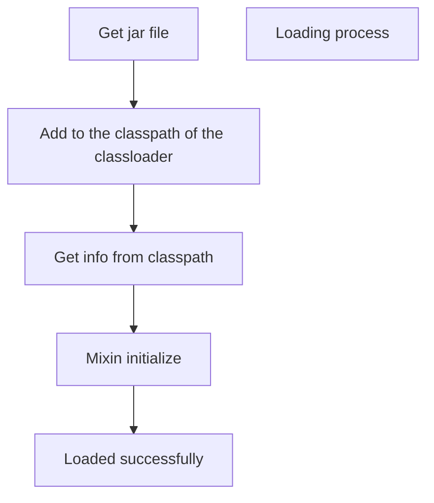

# HumbleLoader

```mermaid
graph TD
A[Get jar file] -->B[Add to the classpath of the classloader] -->C[Get info from classpath] -->D[Mixin initialize] -->E[Loaded successfully] 

    Z[Loading process]
```
